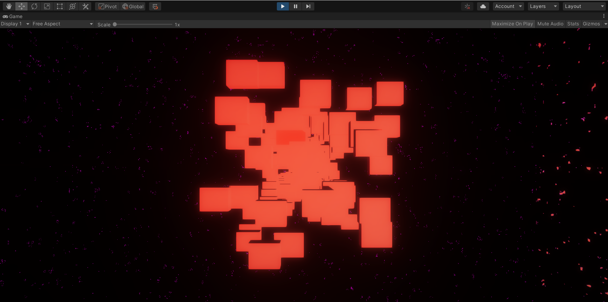
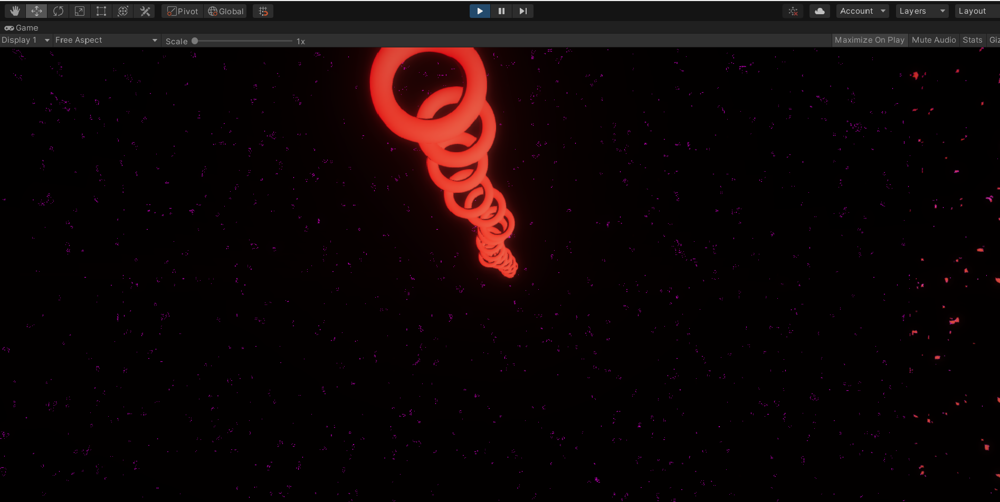
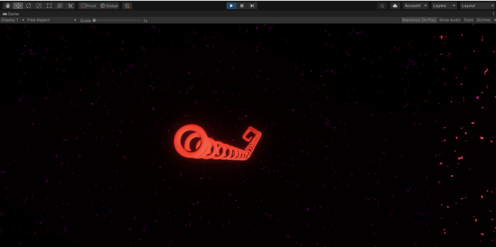

# GoForwardWithGyro
Basicly,player is the camera and enemies moving to the player.Player must move forward without hitting obstacles.Player always moves forward but phone's gyroscope is used for movement in the horizontal and vertical axis.
There 3 options for enemy creation.EnemyCircleSnake option acts like reflection.Enemies are randomly positioned each time for 3 options.
# BoxObstacleEnemy

# CircleObstacleEnemy

# CircleSnakeObstacleEnemy

